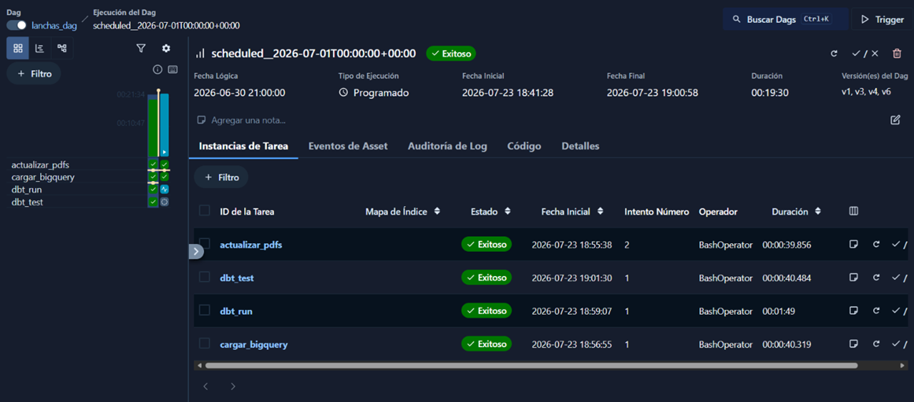
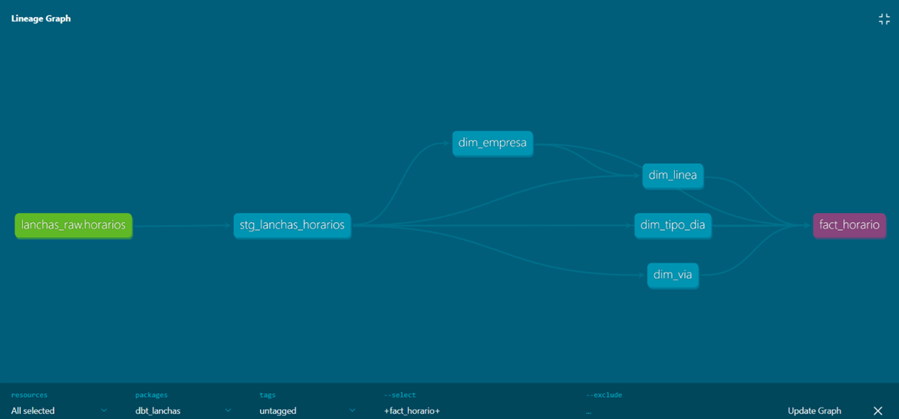
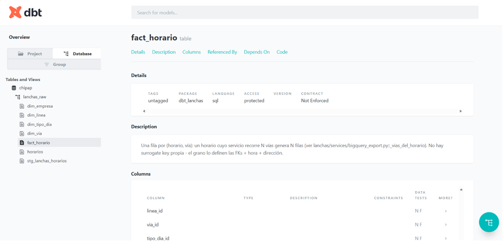

# Lanchas - Horarios del Delta del Tigre

[](https://github.com/chipap-dev/lanchas/actions/workflows/ci.yml)

A Django app that scrapes, parses, and serves the official passenger-boat schedules for the Tigre Delta (Argentina) as a searchable, mobile-friendly timetable (with a BigQuery + dbt + Airflow layer behind it for analytics).

The schedules are split across three companies' PDFs with no single place to check them, and finding a departure time takes longer than it should. I use it myself.

**Dockerized, with real pre-loaded data.** `docker compose up` and go.

---

## What it does

- Parses official government PDF schedules for 3 boat companies with `pdfplumber` (table extraction, color-coded direction detection, footnote matching)
- Normalizes source data into a relational model: companies → lines → services → stops → timetable rows
- Holidays: lines that carry a holiday column in the PDF store it as-is in `Horario.tipo_dia`; Interisleña doesn't have one, so its holidays are resolved at query time by reassigning to Saturday/Sunday
- "Today" view, weekly schedule per direction, JS-free accordion navigation
- Local favorites via `localStorage`, no accounts needed

---

## Data pipeline

```
Government PDFs → parser/loader → Postgres → BigQuery (raw) → dbt → star schema
```

- Postgres is the source of truth; a management command flattens it into `lanchas_raw.horarios` for BigQuery
- dbt models a star schema: `dim_empresa`, `dim_linea`, `dim_via`, `dim_tipo_dia` → `fact_horario` (grain: one row per horario × vía)
- 31 dbt tests (`not_null`, `unique`, `accepted_values`, `relationships`), all green
- Full-refresh load, run monthly by Airflow: fetch → load → `dbt run` → `dbt test`





See [`dbt_lanchas/README.md`](dbt_lanchas/README.md) for the full dbt setup.

---

## Stack

Python 3.11 · Django 4.2 · PostgreSQL 16 · pdfplumber · Docker · pytest + GitHub Actions

Data layer: BigQuery · dbt · Airflow

---

## Architecture

```
lanchas/
├── models/         # Empresa → Linea → Servicio → Horario, Via, Feriado
├── pipeline/       # downloader.py, loader.py
├── services/
│   ├── parsers/         # one parser per company
│   ├── feriados.py      # holiday resolution
│   ├── horarios.py      # query helpers
│   └── bigquery_export.py
└── management/commands/

tests/              # pytest, synthetic PDFs, parser edge cases
dbt_lanchas/         # star schema on lanchas_raw.horarios
airflow_dags/         # lanchas_dag.py
```

---

## Run locally (Docker)

```bash
git clone https://github.com/chipap-dev/lanchas.git
cd lanchas
cp .env.example .env
docker compose up --build
```

Open [http://localhost:8000](http://localhost:8000): first boot loads real, pre-parsed schedule data automatically.

To run the live scrape-and-parse pipeline instead:

```bash
docker compose exec web python manage.py lanchas_actualizar
```

To run the BigQuery + dbt layer, see [`dbt_lanchas/README.md`](dbt_lanchas/README.md).

---

## Testing

```bash
pip install -r requirements_lanchas_dev.txt
pytest -v -m "not smoke" --cov=lanchas.services.parsers --cov-report=term-missing
```

CI runs the full suite on every push to `main`; a weekly cron re-parses the live PDFs to catch upstream format changes.

---

Built by [Claudia Cáceres](https://chipap.net) · [LinkedIn](https://linkedin.com/in/claudiacaceresv) · Buenos Aires, Argentina
